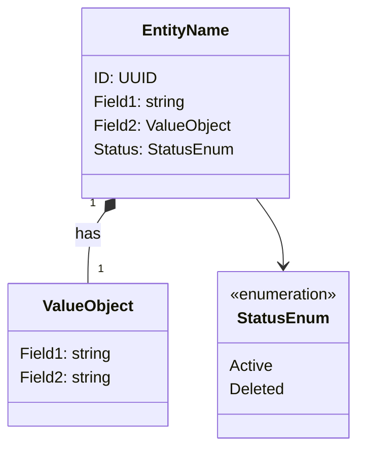

# {ドメイン名} - ドメインモデル

## モデル図

## 集約

### {集約名}（{English Name} Aggregate）

| 要素 | 種別 | 集約ルート |
|------|------|----------|
| {エンティティ名} | エンティティ | Yes |
| {値オブジェクト名} | 値オブジェクト | - |

{集約の操作ルールを記載する}

### 他集約からの参照（IDのみ）

{他ドメインからどのIDで参照されるか記載する}

## 対訳表（ユビキタス言語）

ユビキタス言語は中央ファイル [対訳表.md](../対訳表.md) に集約している。本ドメインの用語は対訳表.md の該当セクションに追記すること（個別ドメインの md には記述しない）。
