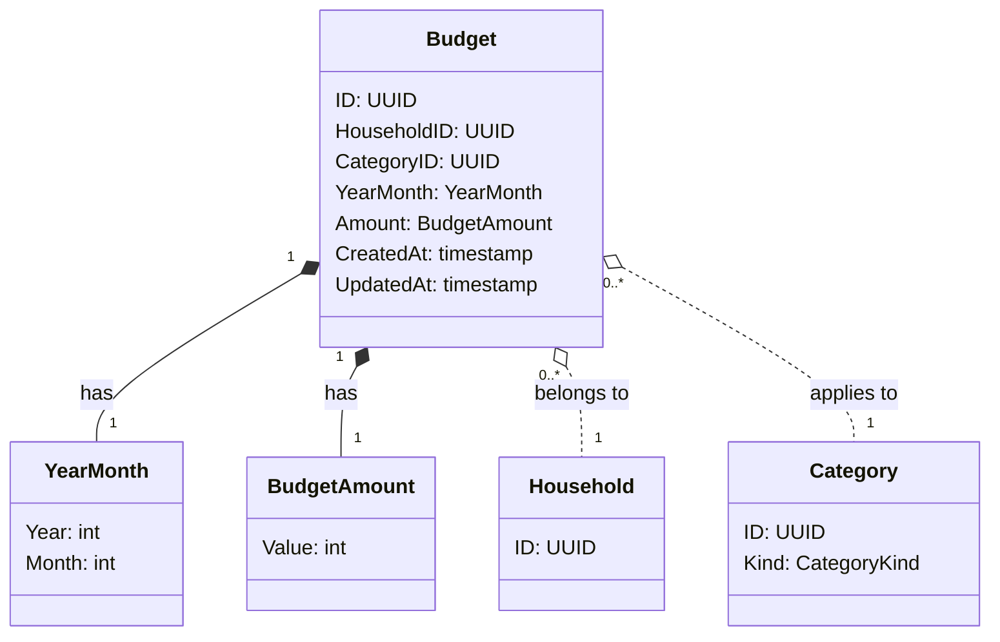

# 予算 - ドメインモデル

## モデル図

> `o..` は集約をまたぐ ID 参照（FK のみ）。

## 集約

### Budget Aggregate（Budget Aggregate）

| 要素 | 種別 | 集約ルート |
|------|------|----------|
| Budget | エンティティ | Yes |
| YearMonth | 値オブジェクト | - |
| BudgetAmount | 値オブジェクト | - |

主な操作:

- **Set**: 管理者が `(HouseholdID, CategoryID, YearMonth)` に対して予算金額を設定。既存があれば上書き（UPSERT）
- **Delete**: 管理者が予算を削除

### 不変条件

- `BudgetAmount` は 1 円以上、999,999,999 円以下（暫定）
- `Category.Kind = Expense` のカテゴリのみ予算設定可能（収入カテゴリ・別家計簿カテゴリは不可）
- `(HouseholdID, CategoryID, YearMonth)` は一意 — 同一カテゴリ × 同一月の予算は 1 件のみ
- `YearMonth` は妥当な年月（実装上は DATE 型で「月の 1 日」として保持）

### 他集約からの参照（ID のみ）

なし。Budget は集計クエリで Entry と組み合わせて使われる（視覚化層の責務）。

## クエリ／集計用途

| クエリ | 用途 | 主な条件 |
|--------|------|---------|
| 対象月のカテゴリ別予算一覧 | 月内累積グラフの予算ライン表示 | HouseholdID, YearMonth |
| 特定カテゴリの月次予算 | カテゴリ詳細ビュー | HouseholdID, CategoryID, YearMonth |

予算ラインの表示判定（QA-E2 確定）:

- 該当 `(HouseholdID, CategoryID, YearMonth)` の Budget が存在 → 予算ラインを描画
- 存在しない → 累積支出のみ描画

## 対訳表（ユビキタス言語）

ユビキタス言語は中央ファイル [対訳表.md](../../対訳表.md) に集約している。本ドメインの用語は [§予算 (Budget)](../../対訳表.md#予算-budget) を参照。
