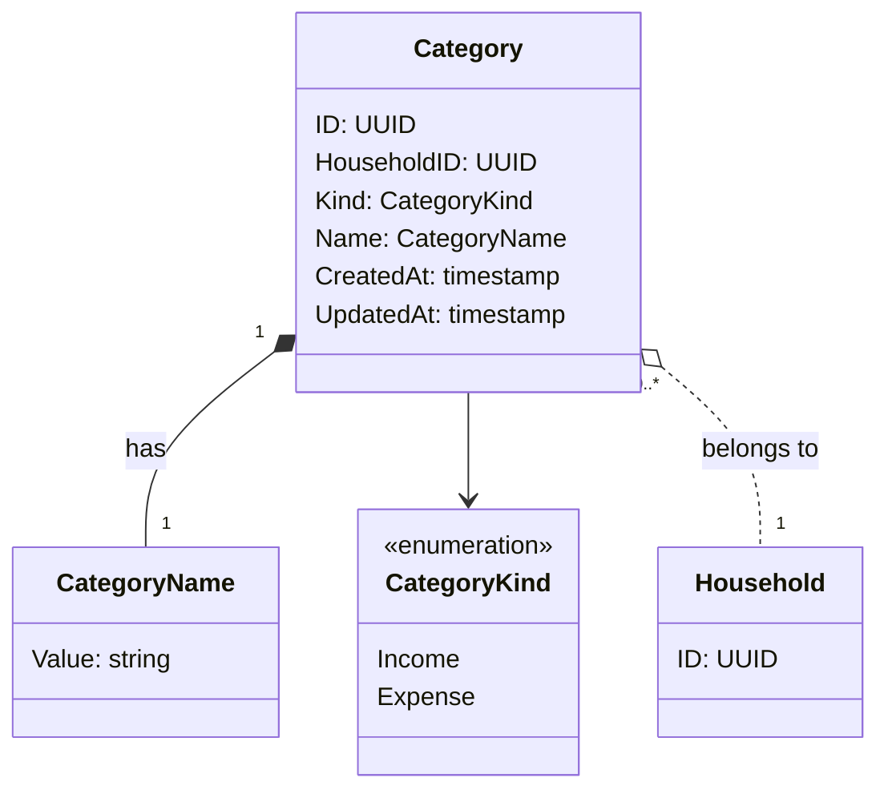

# カテゴリ - ドメインモデル

## モデル図

> `o..` は集約をまたぐ ID 参照（FK のみ）。

## 集約

### Category Aggregate（Category Aggregate）

| 要素 | 種別 | 集約ルート |
|------|------|----------|
| Category | エンティティ | Yes |
| CategoryName | 値オブジェクト | - |
| CategoryKind | 列挙 | - |

Category 集約は家計簿の収入・支出カテゴリの同一性・種別・名前を保持する。並び順や表示／非表示・固定費フラグは個人ごとに異なるため [個人カテゴリ設定](../user-category-preference/index.md) で扱う。

主な操作:

- **Create**: 管理者がカテゴリを追加。種別と名前を指定
- **Rename**: 管理者がカテゴリ名を変更（種別は変更不可）
- **Delete**: 管理者がカテゴリを削除。明細が紐付いている場合は拒否

### 不変条件

- `Kind` は作成後変更不可
- `(HouseholdID, Kind, Name)` は一意 — 同一家計簿の同一種別でカテゴリ名は重複不可（DB の複合一意制約）

### 他集約からの参照（ID のみ）

| 参照元集約 | 参照内容 | 用途 |
|-----------|---------|------|
| UserCategoryPreference | Category.ID | カテゴリごとの個人設定。`ON DELETE CASCADE` |
| Entry | Category.ID | 収支明細のカテゴリ。削除時のバリデーション対象 |
| Budget | Category.ID | 月次予算（支出カテゴリのみ）。`ON DELETE CASCADE` |

Category 削除時の挙動:

- Entry 参照あり → 削除拒否（業務ルール）
- UserCategoryPreference / Budget → DB の `ON DELETE CASCADE` で連鎖削除

## 対訳表（ユビキタス言語）

ユビキタス言語は中央ファイル [対訳表.md](../../対訳表.md) に集約している。本ドメインの用語は [§カテゴリ (Category)](../../対訳表.md#カテゴリ-category) を参照。
