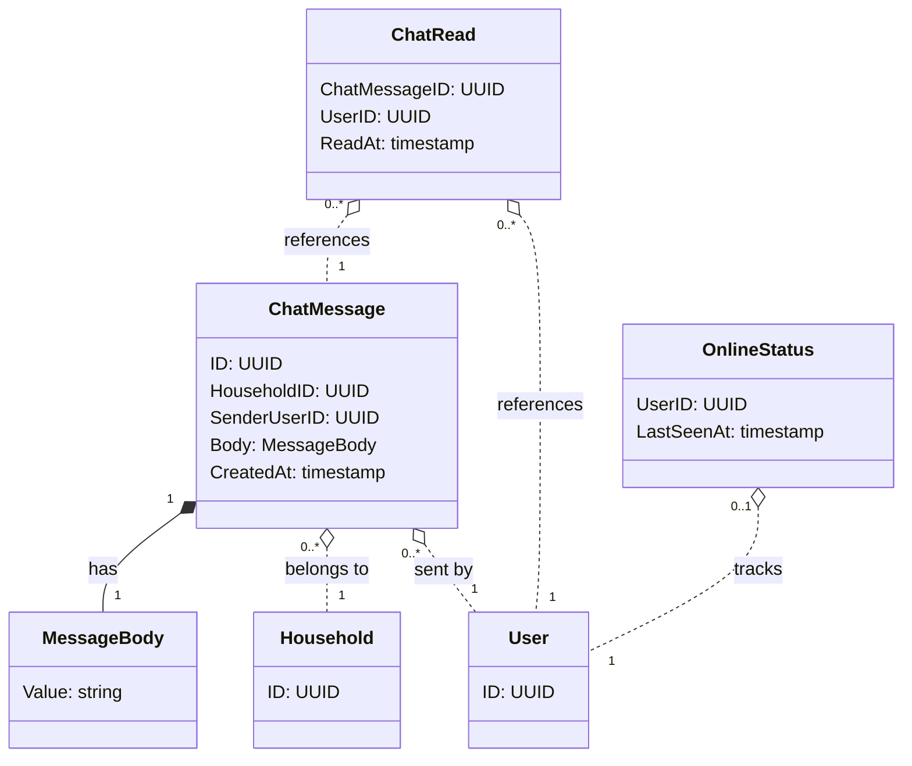

# チャット - ドメインモデル

## モデル図

チャットドメインは 3 つの独立した集約から構成される（ChatMessage / ChatRead / OnlineStatus）。

> `o..` は集約をまたぐ ID 参照（FK のみ）。

## 集約

### ChatMessage Aggregate（ChatMessage Aggregate）

| 要素 | 種別 | 集約ルート |
|------|------|----------|
| ChatMessage | エンティティ | Yes |
| MessageBody | 値オブジェクト | - |

主な操作:

- **Post**: Active メンバーがメッセージを投稿。CreatedAt = now()
- **編集・削除**: v1 では提供しない

#### 不変条件

- `Body`（MessageBody）は 1〜500 文字
- `SenderUserID` は `HouseholdID` の Active な Membership を持つ User
- 投稿後の本文変更不可（v1 スコープ）

### ChatRead Aggregate（ChatRead Aggregate）

| 要素 | 種別 | 集約ルート |
|------|------|----------|
| ChatRead | エンティティ | Yes |

主な操作:

- **BulkInsert（自動既読化）**: チャット画面表示時、ユーザーが未読のメッセージに対して ChatRead レコードを一括 INSERT

#### 不変条件

- `(ChatMessageID, UserID)` は一意（複合主キー、または UUID + 複合一意制約のいずれか）
- `ChatRead.UserID` は対象メッセージの家計簿の Active な Membership を持つ User
- 自分が送信したメッセージの ChatRead は作成しない（送信者には不要）

### OnlineStatus Aggregate（OnlineStatus Aggregate）

| 要素 | 種別 | 集約ルート |
|------|------|----------|
| OnlineStatus | エンティティ | Yes |

主な操作:

- **Touch**: ユーザーの認証付き API リクエスト時に `LastSeenAt` を現在時刻で UPSERT
- **IsOnline(threshold)**: `LastSeenAt > now() - threshold` を判定するクエリ用関数

#### 不変条件

- `UserID` は一意（1 ユーザー 1 OnlineStatus）

## 他集約からの参照（ID のみ）

なし。本ドメインの集約は他ドメインから参照されない。

## カスケード削除

| 削除対象 | カスケード先 | 仕組み |
|----------|------------|--------|
| Household 削除 | ChatMessage 全削除 | DB の `ON DELETE CASCADE`（household_id FK）|
| ChatMessage 削除 | 関連 ChatRead 全削除 | DB の `ON DELETE CASCADE`（chat_message_id FK）|
| User 削除（退会はソフト削除なので発生せず、将来用） | OnlineStatus 削除、ChatRead 削除 | `ON DELETE CASCADE` |

## 対訳表（ユビキタス言語）

ユビキタス言語は中央ファイル [対訳表.md](../../対訳表.md) に集約している。本ドメインの用語は [§チャット (ChatMessage)](../../対訳表.md#チャット-chatmessage) を参照。
