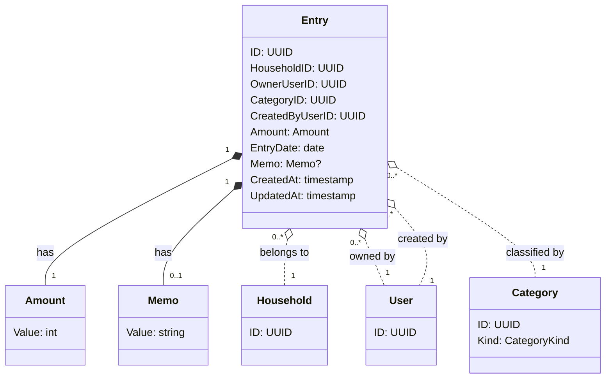

# 収支明細 - ドメインモデル

## モデル図

> `o..` は集約をまたぐ ID 参照（FK のみ）。

### 区分（EntryKind）の取り扱い

Entry 自体は `EntryKind` を保持しない。明細の収入／支出区分は紐付く `Category.Kind` から導出する。
これにより「区分とカテゴリの整合性」を別途検証する必要がなくなる。

## 集約

### Entry Aggregate（Entry Aggregate）

| 要素 | 種別 | 集約ルート |
|------|------|----------|
| Entry | エンティティ | Yes |
| Amount | 値オブジェクト | - |
| Memo | 値オブジェクト | - |

主な操作:

- **Create**: 認証済みかつ家計簿所属ユーザーが収支を登録。代理入力時は `OwnerUserID ≠ CreatedByUserID`
- **Update**: 認証済みかつ家計簿所属ユーザーが既存 Entry を編集。**`OwnerUserID` は変更不可**、それ以外は編集可
- **Delete**: 認証済みかつ家計簿所属ユーザーが Entry を削除
- **BulkCreateFromCSV**: 管理者が CSV から一括登録。重複検知あり
- **MonthlyFixedCostCopy**: 月初バッチがメンバー × 支出カテゴリ単位で前月明細を当月にコピー

### 不変条件

- `Amount` は 1 円以上、9,999,999 円以下（暫定。実装時に調整可）
- `Memo` は 0〜200 文字
- `EntryDate` は妥当な暦日（過去・未来とも許容）
- `OwnerUserID` は Entry 作成時点で対象 Household の **Active な Membership を持つ User**
- `CreatedByUserID` は Entry 作成時点で対象 Household の Active な Membership を持つ User（操作者本人）
- `CategoryID` は Entry の HouseholdID と同じ家計簿に所属するカテゴリ
- `OwnerUserID` は作成後変更不可

### 他集約からの参照（ID のみ）

なし。Entry は他ドメインから直接参照されない。集計のためのクエリ対象として扱われる。

## クエリ／集計用途

Entry ドメインは以下のクエリを提供する（リポジトリ／クエリサービス層で実装）:

| クエリ | 用途 | 主な条件 |
|--------|------|---------|
| 月別収支推移 | 視覚化（月別棒・折れ線グラフ） | HouseholdID, 期間（年単位など） |
| カテゴリ別支出割合 | 視覚化（円・ドーナツグラフ） | HouseholdID, 期間, Kind=Expense |
| メンバー別支出比率 | 視覚化 | HouseholdID, 期間, Kind=Expense, GROUP BY OwnerUserID |
| 月内累積支出 | 視覚化（累積グラフ） | HouseholdID, 対象月, Kind=Expense, 日付単位累積 |
| カテゴリ別年間推移 | 視覚化（過去 12 ヶ月） | HouseholdID, CategoryID, 12 ヶ月分 |
| カテゴリの明細存在チェック | カテゴリ削除時のバリデーション | CategoryID で `EXISTS` |
| CSV 重複検知 | CSV インポート時 | HouseholdID, EntryDate, CategoryID, Amount での照合 |
| 前月固定費明細取得 | 月初コピーバッチ | HouseholdID, OwnerUserID, CategoryID, 前月の EntryDate |

すべての集計は **暦月（1 日〜末日）** を単位とする（要件定義書 §6.1）。

## 対訳表（ユビキタス言語）

ユビキタス言語は中央ファイル [対訳表.md](../../対訳表.md) に集約している。本ドメインの用語は [§収支明細 (Entry)](../../対訳表.md#収支明細-entry) を参照。
