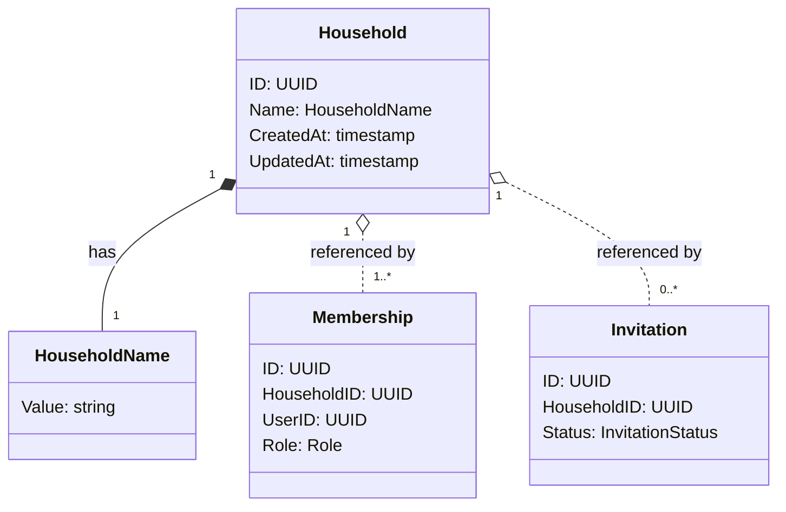

# 家計簿 - ドメインモデル

## モデル図

家計簿とその直接関連（メンバーシップ・招待）を含めた俯瞰図を以下に示す。集約境界は破線で区切る。

> `o..` は集約をまたぐ ID 参照（FK のみ）。`*--` は同一集約内のコンポジション。

## 集約

### Household Aggregate（Household Aggregate）

| 要素 | 種別 | 集約ルート |
|------|------|----------|
| Household | エンティティ | Yes |
| HouseholdName | 値オブジェクト | - |

Household 集約は家計簿の同一性と名前を保持するだけのシンプルな集約。所属関係・招待・収支データは別集約に分離する。

主な操作:

- **Create**: 家計簿を作成。アプリケーション層で Membership(Role=Admin) の作成と同一トランザクションに含める
- **Rename**: 家計簿名を変更
- **Delete**: 家計簿を削除。DB の `ON DELETE CASCADE` で下流ドメインのデータが一括削除される

### 他集約からの参照（ID のみ）

| 参照元集約 | 参照内容 | 用途 |
|-----------|---------|------|
| Membership | Household.ID | 所属関係 |
| Invitation | Household.ID | 招待先 |
| Category | Household.ID | カテゴリの所属 |
| Entry | Household.ID | 収支明細の所属 |
| Budget | Household.ID | 予算の所属 |
| ChatMessage | Household.ID | チャットルームの所属 |

すべての参照は `ON DELETE CASCADE` を設定する。

## 対訳表（ユビキタス言語）

ユビキタス言語は中央ファイル [対訳表.md](../../対訳表.md) に集約している。本ドメインの用語は [§家計簿 (Household)](../../対訳表.md#家計簿-household) を参照。
