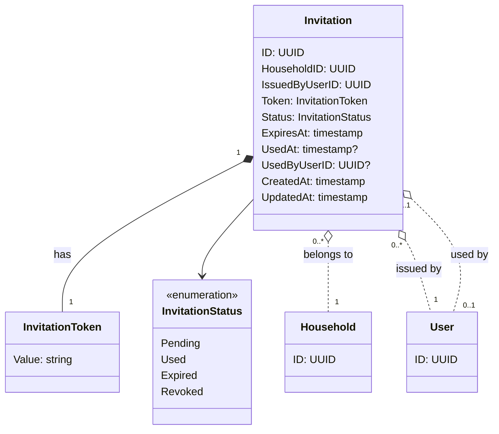

# 招待 - ドメインモデル

## モデル図



> `o..` は集約をまたぐ ID 参照（FK のみ）。

## 集約

### Invitation Aggregate（Invitation Aggregate）

| 要素 | 種別 | 集約ルート |
|------|------|----------|
| Invitation | エンティティ | Yes |
| InvitationToken | 値オブジェクト | - |
| InvitationStatus | 列挙 | - |

Invitation 集約は招待 URL の同一性・有効期限・状態・発行者・使用者を保持する。

主な操作:

- **Issue**: 招待 URL を発行する。既存の Pending を Revoked にして新規 Pending を作成（同一トランザクション）
- **Consume**: 招待 URL を消費して家計簿に参加。Status を Pending → Used、UsedAt と UsedByUserID を記録。同時に Membership 作成（アプリケーション層で同一トランザクション）
- **Expire**: 期限切れを判定（明示的な状態更新は行わず、クエリ時に `ExpiresAt < now()` で判定。バッチで Pending → Expired に書き換えるかは実装で選択可）

### 不変条件

- `Token` は全 Invitation で一意（衝突回避のためランダム性が必要）
- 1 つの HouseholdID に対し、`Status=Pending` のレコードは最大 1 件 — DB の部分一意インデックスで保証
- `ExpiresAt` は `CreatedAt + 24 時間` 固定
- `Status=Used` のとき `UsedAt` と `UsedByUserID` は NOT NULL

### 状態遷移

```
              Issue
[未存在] --------------> Pending
                          |
                          |--- Consume(成功) ---> Used
                          |--- 24h 経過 -------> Expired
                          |--- 新規 Issue -----> Revoked
```

### 他集約からの参照（ID のみ）

なし（招待は使い捨ての一時的なリソース。他ドメインから直接参照しない）。

Invitation が `Used` 状態になったとき、Membership ドメインで Member ロールのメンバーシップが作成されるが、Membership 側に InvitationID を持たせる必要はない（要件定義書で監査ログは非保持、§11）。

## 対訳表（ユビキタス言語）

ユビキタス言語は中央ファイル [対訳表.md](../../対訳表.md) に集約している。本ドメインの用語は [§招待 (Invitation)](../../対訳表.md#招待-invitation) を参照。
