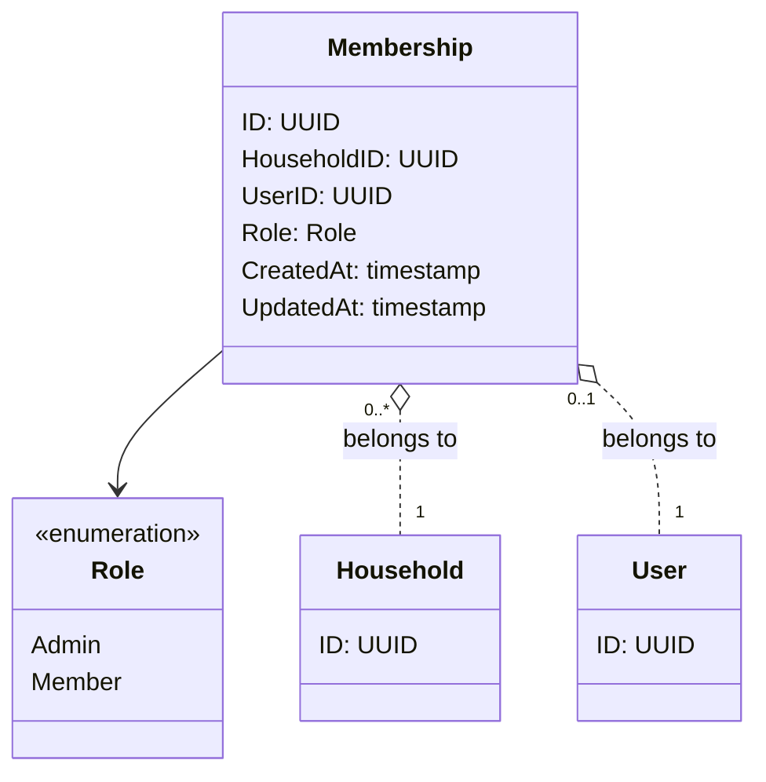

# メンバーシップ - ドメインモデル

## モデル図

> `o..` は集約をまたぐ ID 参照（FK のみ）。Household / User の詳細は各ドメインのモデル参照。

## 集約

### Membership Aggregate（Membership Aggregate）

| 要素 | 種別 | 集約ルート |
|------|------|----------|
| Membership | エンティティ | Yes |
| Role | 列挙 | - |

Membership 集約はユーザーと家計簿の所属関係およびロールを保持する。所属関係そのもの以外の責務は持たない。

主な操作:

- **Create(Admin)**: 家計簿作成と同じトランザクションで、作成者の Admin Membership を作成
- **Create(Member)**: 招待 URL 受諾と同じトランザクションで、参加者の Member Membership を作成

v1 ではロール変更・脱退・除外は提供しない。Membership は Household の `ON DELETE CASCADE` で削除される。

### 不変条件

- (UserID) は一意 — 1 ユーザーは 1 家計簿のみに所属
- (HouseholdID, Role=Admin) は一意 — 1 家計簿に管理者は 1 人のみ
- Role は作成後変更不可（v1 スコープ）

### 他集約からの参照（ID のみ）

なし。Membership は他ドメインから直接参照されない（Entry / ChatMessage 等は User.ID と Household.ID を直接参照する）。
Membership は「誰がどの家計簿に所属しているか」のクエリ用途で使う。

## 対訳表（ユビキタス言語）

ユビキタス言語は中央ファイル [対訳表.md](../../対訳表.md) に集約している。本ドメインの用語は [§メンバーシップ (Membership)](../../対訳表.md#メンバーシップ-membership) を参照。
