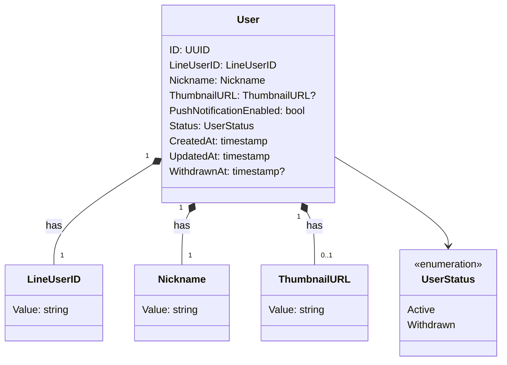

# ユーザー - ドメインモデル

## モデル図

## 集約

### User Aggregate（User Aggregate）

| 要素 | 種別 | 集約ルート |
|------|------|----------|
| User | エンティティ | Yes |
| LineUserID | 値オブジェクト | - |
| Nickname | 値オブジェクト | - |
| ThumbnailURL | 値オブジェクト | - |
| UserStatus | 列挙 | - |

User 集約は、LINE 認証されたユーザー本人の認証情報・プロフィール・通知設定をまとめる。

主な操作:

- **Register**: LINE 認証成功時に呼ばれ、`Nickname` 空・`PushNotificationEnabled=true` でユーザーを作成
- **UpdateProfile**: `Nickname` と `ThumbnailURL` を設定（初回登録／編集を兼用）
- **UpdateNotificationSetting**: `PushNotificationEnabled` を切替
- **Withdraw**: `Status` を `Withdrawn` に変更、`WithdrawnAt` に現在時刻を記録

### 他集約からの参照（ID のみ）

| 参照元集約 | 参照内容 | 用途 |
|-----------|---------|------|
| Membership | User.ID | 家計簿への所属関係 |
| Entry | User.ID | 収支明細の所有者 |
| Invitation | User.ID | 招待 URL の発行者 |
| ChatMessage | User.ID | メッセージの送信者 |
| ChatRead | User.ID | メッセージの既読者 |

参照元は User の状態（Active / Withdrawn）に依らず ID で参照する。Withdrawn ユーザーは「退会済みユーザー」として表示される（表示ロジックは UI 側または各ドメインの責務）。

## 対訳表（ユビキタス言語）

ユビキタス言語は中央ファイル [対訳表.md](../../対訳表.md) に集約している。本ドメインの用語は [§ユーザー (User)](../../対訳表.md#ユーザー-user) を参照。
