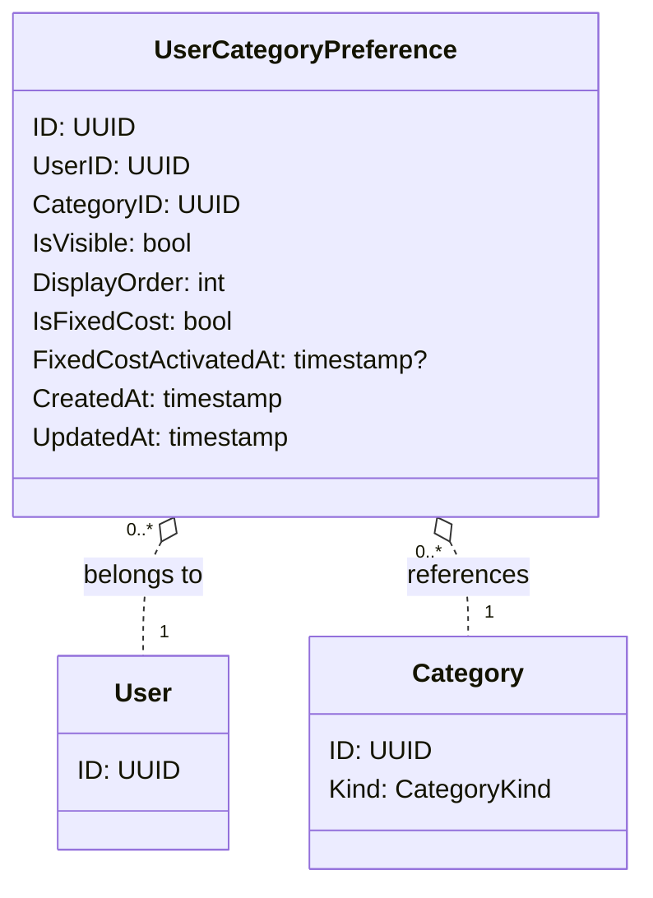

# 個人カテゴリ設定 - ドメインモデル

## モデル図

> `o..` は集約をまたぐ ID 参照（FK のみ）。

## 集約

### UserCategoryPreference Aggregate（UserCategoryPreference Aggregate）

| 要素 | 種別 | 集約ルート |
|------|------|----------|
| UserCategoryPreference | エンティティ | Yes |

主な操作:

- **Upsert**: ユーザーが任意のカテゴリの設定を変更（表示／非表示・並び順・固定費）。レコードがなければ INSERT、あれば UPDATE
- **ListForUser**: ユーザー × Household 単位で全カテゴリと設定をマージしたビューを返す（レコードがなければデフォルト値）

### 不変条件

- `(UserID, CategoryID)` は一意 — 同じユーザー × 同じカテゴリで設定レコードは 1 件のみ
- `IsFixedCost=true` は `Category.Kind=Expense` のときのみ許容（収入カテゴリは常に false）
- `IsFixedCost=true` のとき `FixedCostActivatedAt` は NOT NULL
- `IsFixedCost=false` のとき `FixedCostActivatedAt` は NULL

### Lazy 作成と削除

- ユーザーがデフォルト値と異なる設定を行う時点で初めて INSERT される
- 全フィールドがデフォルト値に戻る場合は DELETE してもよい（実装で選択可）
- Category 削除時、関連する UserCategoryPreference は DB の `ON DELETE CASCADE` で削除される
- User 削除（退会はソフト削除のため発生しないが、将来の物理削除を想定）時も `ON DELETE CASCADE`

### デフォルト値

UserCategoryPreference レコードが存在しないカテゴリは、アプリケーション層で以下のデフォルト値として扱う:

| フィールド | デフォルト値 |
|-----------|------------|
| IsVisible | true |
| DisplayOrder | Category.CreatedAt の昇順（カテゴリ作成順） |
| IsFixedCost | false |
| FixedCostActivatedAt | NULL |

### 他集約からの参照（ID のみ）

| 参照元集約 | 参照内容 | 用途 |
|-----------|---------|------|
| Entry（固定費自動コピーバッチ） | UserCategoryPreference の `IsFixedCost`, `FixedCostActivatedAt` | 月初コピー対象判定 |

参照は ID ではなくクエリで取得する（バッチが Preference を走査して対象を決める）。

## 対訳表（ユビキタス言語）

ユビキタス言語は中央ファイル [対訳表.md](../対訳表.md) に集約している。本ドメインの用語は [§個人カテゴリ設定 (UserCategoryPreference)](../対訳表.md#個人カテゴリ設定-usercategorypreference) を参照。
