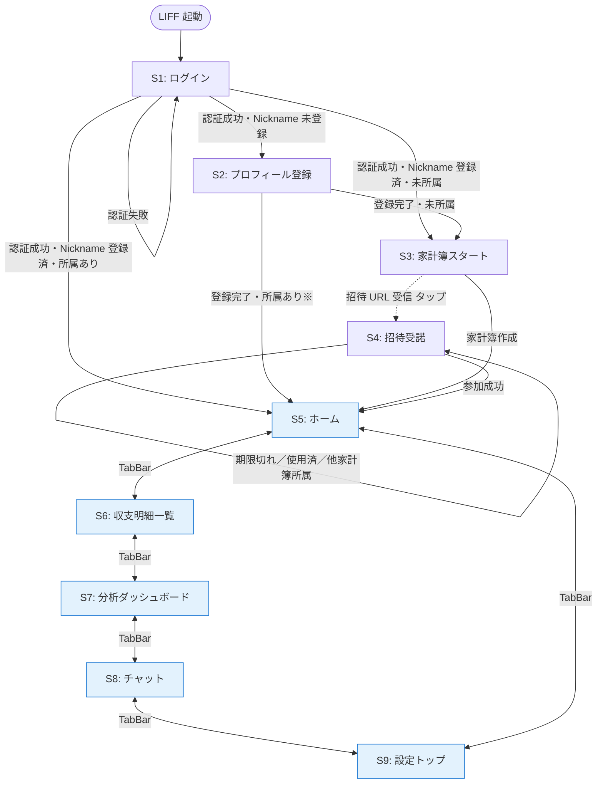
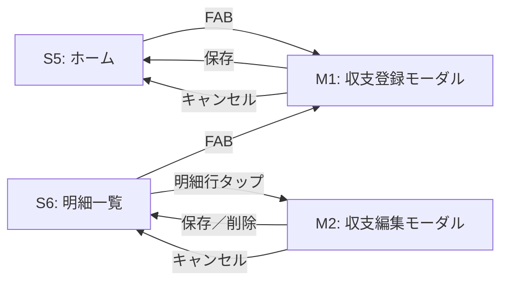
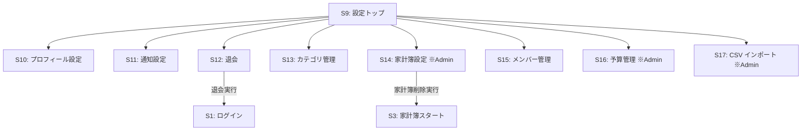

# 画面一覧

家計簿アプリ（LIFF ミニアプリ）の全画面を 1 枚に集約した俯瞰ドキュメント。
[機能一覧.md](機能一覧.md) と対になるドキュメントで、「機能 ↔ 画面」の両側面を 1 セットで確認できる。

## 使い方

- **設計レビュー時**: 画面の役割・認可・LIFF 要否を一望し、機能の置き場所を確認する
- **要件確認時**: 顧客に「v1 で持つ画面」を見せるカタログとして使う
- **実装計画時**: `pages/` レイヤーのスライス分割と vue-router の `meta` 設計に反映する

## 凡例

### レイアウト

| 表記 | 意味 |
|------|------|
| `Blank` | ヘッダー・タブバーなし。ログイン・オンボーディング・招待受諾で使用 |
| `Default` | 上部ヘッダー + 下部タブバー（ホーム／明細／分析／チャット／設定）。メイン画面で使用 |
| `Modal` | スタック表示のモーダル／オーバーレイ。親画面の状態を保ったまま開く |

### 認可（router `meta.requiresXxx` に対応）

| 表記 | 意味 |
|------|------|
| `Public` | 認証不要。LINE Login 前から閲覧可 |
| `Authed` | LINE 認証済みなら誰でも閲覧可（家計簿所属は問わない） |
| `Authed-NoHousehold` | 認証済みかつ Membership を持たない状態に限り閲覧可 |
| `Member` | 対象家計簿の Active な Membership を持つこと |
| `Admin` | 対象家計簿の `Role=Admin` の Membership を持つこと |

### LIFF 要否

| 表記 | 意味 |
|------|------|
| `LIFF` | LIFF コンテキストでのみ動作。外部ブラウザ単独利用は v1 では想定しない |

> 要件定義書 §5.5 に従い、v1 は全画面が `LIFF` 前提。ただし招待 URL は LINE 外で受け取って LIFF で開く動線があるため、`/invite/:token` のみ「外部ブラウザでも一度読み込み可（ただし操作には LINE Login が必須）」とする。

## 画面一覧（全 19 画面）

| # | 画面名 | パス | レイアウト | 認可 | LIFF | 主な役割 | 画面内構成 | 対応機能 # |
|---|--------|------|-----------|------|------|---------|-----------|----------|
| S1 | ログイン | `/login` | Blank | Public | LIFF | LINE Login を起動し、認証後に適切な遷移先へ振り分け | LINE ログインボタン、利用規約リンク | #1 |
| S2 | プロフィール登録（初回） | `/onboarding/profile` | Blank | Authed | LIFF | LINE 認証後、Nickname 未登録なら強制表示 | Nickname 入力、サムネ任意、保存ボタン | #2 |
| S3 | 家計簿スタート | `/onboarding/household` | Blank | Authed-NoHousehold | LIFF | 家計簿を新規作成 or 招待 URL の到着を待つ案内 | 家計簿作成フォーム、「招待 URL を待つ」案内 | #5 |
| S4 | 招待受諾 | `/invite/:token` | Blank | Authed-NoHousehold | LIFF | 招待 URL の有効性検証 → 受諾確認 → 参加実行 | 家計簿名表示、参加確認ボタン、エラー（期限切れ／使用済／他家計簿所属） | #10 |
| S5 | ホーム | `/home` | Default | Member | LIFF | 当月収支サマリと直近明細のダッシュボード | 当月 収入／支出／差額カード、直近 5 件の明細、収支登録 FAB | 視覚化（月別推移） |
| S6 | 収支明細一覧 | `/entries` | Default | Member | LIFF | 月別の全明細を一覧表示。フィルタ・編集導線の中心 | 月切替、カテゴリ／メンバー絞り込み、明細行（タップで編集モーダル）、収支登録 FAB | #18, #19 |
| S7 | 分析ダッシュボード | `/analytics` | Default | Member | LIFF | 視覚化 5 種を 1 画面・タブ切替で表示（要件 §4.1 確定事項） | タブ: 月別推移／カテゴリ別割合／メンバー別比率／月内累積／年間推移 | 視覚化 5 クエリ |
| S8 | チャット | `/chat` | Default | Member | LIFF | グループチャット送受信。表示時に自動既読化 | メッセージリスト、入力欄、送信ボタン、各メッセージの既読アイコン、メンバーのオンライン表示 | #24, #25, #26 |
| S9 | 設定トップ | `/settings` | Default | Member | LIFF | 個人設定・家計簿設定の入口ハブ | 「個人設定」「家計簿設定」「データ管理」の 3 セクション + 各サブ画面リンク | （ハブ） |
| S10 | プロフィール設定 | `/settings/profile` | Default | Member | LIFF | Nickname・サムネ編集 | Nickname 入力、サムネ任意、保存 | #2 |
| S11 | 通知設定 | `/settings/notifications` | Default | Member | LIFF | Push 通知 ON/OFF 切替 | `PushNotificationEnabled` トグル | #3 |
| S12 | 退会 | `/settings/withdraw` | Default | Member | LIFF | アカウント退会の確認と実行 | 退会後の挙動説明、確認チェックボックス、退会ボタン | #4 |
| S13 | カテゴリ管理 | `/settings/categories` | Default | Member / Admin | LIFF | 家計簿カテゴリ（管理者操作）と個人カテゴリ設定の混在画面。タブで切替 | タブ「家計簿のカテゴリ」（Admin のみ追加・編集・削除可）／「個人の表示・並び・固定費」 | #11, #12, #13, #14, #15, #16 |
| S14 | 家計簿設定 | `/settings/household` | Default | Admin | LIFF | 家計簿名の編集・家計簿削除 | 家計簿名入力、保存、削除（確認ダイアログ付き） | #6, #7 |
| S15 | メンバー管理 | `/settings/members` | Default | Member / Admin | LIFF | 全メンバー一覧と招待 URL 発行（招待は Admin のみ） | メンバーリスト（Nickname・サムネ・ロール・参加日時）、「招待 URL を発行する」ボタン（Admin のみ）、発行後の URL コピー UI | #8, #9 |
| S16 | 予算管理 | `/settings/budgets` | Default | Admin | LIFF | 月次予算の設定・編集・削除 | 月切替、支出カテゴリごとの予算金額入力、削除ボタン | #22, #23 |
| S17 | CSV インポート | `/settings/import` | Default | Admin | LIFF | CSV ファイルから収支明細を一括登録 | ファイル選択、プレビュー、重複検知結果、取り込み確定 | #20 |
| M1 | 収支登録モーダル | `(modal)` | Modal | Member | LIFF | ホーム／明細一覧の FAB から起動 | カテゴリ選択、金額、日付、所有者選択（代理入力）、メモ任意、保存 | #17 |
| M2 | 収支編集モーダル | `(modal)` | Modal | Member | LIFF | 明細一覧の行タップから起動 | カテゴリ・金額・日付・メモ編集（所有者は変更不可）、削除ボタン | #18, #19 |

> 機能 #21（固定費の月初自動コピー）は**システムバッチ**のため画面なし。
> ChatMessage の OnlineStatus UPSERT（認証付き全 API で middleware 実行）も画面操作を持たない。

## 画面遷移図

### 主要フロー（初回利用〜定常利用）

> ※ プロフィール登録直後に所属ありになるケースは、招待 URL を別タブで先に踏んだ後に Nickname 登録した動線（レアケース）。

### 収支登録・編集（モーダル）

### 設定配下のサブ画面

> 家計簿削除後は、管理者本人は Membership ごと消えるため未所属状態に戻り、S3 に戻される。
> 退会後は LIFF からのアクセスが拒否されるため、S1 に戻された上でログイン不可になる。

## 機能 ↔ 画面 マッピング（26 操作）

[機能一覧.md](機能一覧.md) の各操作がどの画面で実行されるかの逆引き。

| 機能 # | 機能名 | 実行画面 |
|--------|-------|---------|
| #1 | LINE でログインする | S1 |
| #2 | プロフィールを登録・編集する | S2（初回）／ S10（編集） |
| #3 | 通知設定を変更する | S11 |
| #4 | アカウントを退会する | S12 |
| #5 | 家計簿を作成する | S3 |
| #6 | 家計簿名を編集する | S14 |
| #7 | 家計簿を削除する | S14 |
| #8 | 家計簿のメンバー一覧を確認する | S15 |
| #9 | 招待 URL を発行する | S15 |
| #10 | 招待 URL で家計簿に参加する | S4 |
| #11 | カテゴリを追加する | S13（家計簿タブ） |
| #12 | カテゴリを編集する | S13（家計簿タブ） |
| #13 | カテゴリを削除する | S13（家計簿タブ） |
| #14 | カテゴリの表示／非表示を切り替える | S13（個人タブ） |
| #15 | 支出カテゴリの並び順を変更する | S13（個人タブ） |
| #16 | 固定費フラグを設定する／解除する | S13（個人タブ） |
| #17 | 収支を登録する | M1（呼び出し元: S5／S6） |
| #18 | 収支明細を編集する | M2（呼び出し元: S6） |
| #19 | 収支明細を削除する | M2（呼び出し元: S6） |
| #20 | CSV インポート | S17 |
| #21 | 固定費の月初自動コピー | （画面なし／システムバッチ） |
| #22 | 月次予算を設定・編集する | S16 |
| #23 | 月次予算を削除する | S16 |
| #24 | メッセージを送信する | S8 |
| #25 | メッセージを取得＋自動既読化 | S8（画面表示時に自動実行） |
| #26 | オンライン状態を確認する | S8（メッセージリスト中で表示） |

## レイアウト・認可サマリ

| レイアウト | 画面数 | 画面 |
|-----------|------|------|
| Blank | 4 | S1, S2, S3, S4 |
| Default | 13 | S5〜S17 |
| Modal | 2 | M1, M2 |
| **合計** | **19** | |

| 認可 | 画面数 | 画面 |
|------|------|------|
| Public | 1 | S1 |
| Authed | 1 | S2 |
| Authed-NoHousehold | 2 | S3, S4 |
| Member（Admin/Member 共通） | 11 | S5, S6, S7, S8, S9, S10, S11, S12, S13, S15, M1, M2（実画面 11） |
| Admin 限定 | 4 | S14, S16, S17, S13 の家計簿タブ |
| **実画面合計** | **19** | （Admin 限定の中で S13 はタブで Member と共有） |

## 関連ドキュメント

- [機能一覧](機能一覧.md) — 全 26 操作の権限・トリガー・副作用
- [集約俯瞰図](集約俯瞰図.md) — ドメインモデル側の俯瞰（11 集約と ID 参照）
- [ER 図（DBML）](er.dbml) — 全 11 テーブルのスキーマ定義
- [ユースケース図 usecase.drawio](usecase.drawio) — ユーザー視点の 21 UC（アクター・includes 関係）
- [要件定義書 §4.1 機能仕様](../要件定義書.md) — 顧客向け機能一覧
- [ADR-0001 フロントエンドアーキテクチャ](../adr/frontend/0001-architecture.md) — FSD レイヤーと依存ルール
