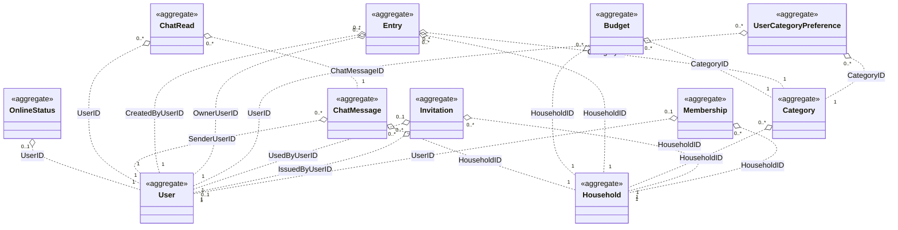
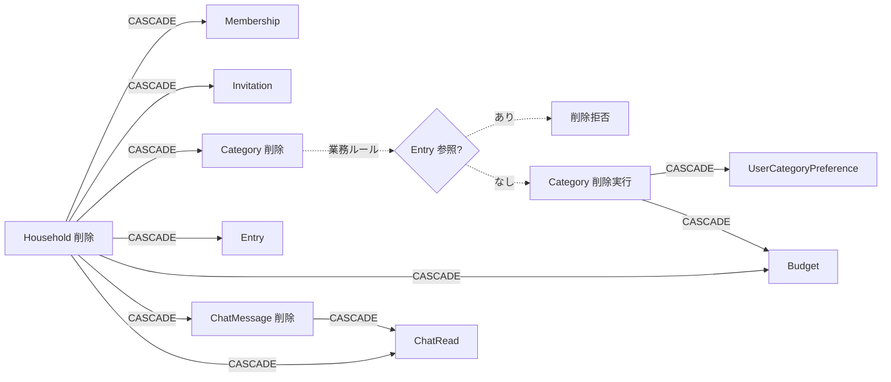

# 集約俯瞰図

家計簿アプリの全ドメイン（9 ドメイン・11 集約）を 1 枚で見渡すためのドキュメント。
各ドメイン詳細は [README](README.md) からリンクされる個別の `ドメインモデル.md` を参照。

## 凡例

| 記号 | 意味 |
|------|------|
| `*--` | 同一集約内のコンポジション（値オブジェクト・子エンティティ） |
| `o..` | 集約をまたぐ ID 参照（DB 上の FK のみ。実体ロードはしない） |
| `<<enumeration>>` | 列挙型 |
| `<<aggregate>>` | 集約ルート（本図でのみ付与。各ドメインの詳細図では省略） |

## 集約間 ID 参照マップ（俯瞰）

集約ルートのみを抜き出し、どの集約が他のどの集約を ID で参照しているかを一覧する。
全 11 集約 × ID 参照のみ。値オブジェクトと列挙は次節の「全集約詳細図」を参照。

> Membership は他集約から直接参照されない（クエリ用途のみ）。Entry / ChatMessage 等は User.ID と Household.ID を直接参照することで「家計簿への所属」を判定する。

## 全集約詳細図

各集約の値オブジェクト・列挙を含めた詳細図を、ドメイン単位（mermaid `namespace`）でグルーピングして 1 枚に集める。
チャットドメインのみ 3 集約（ChatMessage / ChatRead / OnlineStatus）を内包する。

```mermaid
classDiagram
    namespace ユーザー {
        class User {
            ID: UUID
            LineUserID: LineUserID
            Nickname: Nickname
            ThumbnailURL: ThumbnailURL?
            PushNotificationEnabled: bool
            Status: UserStatus
            WithdrawnAt: timestamp?
        }
        class LineUserID
        class Nickname
        class ThumbnailURL
        class UserStatus {
            <<enumeration>>
            Active
            Withdrawn
        }
    }

    namespace 家計簿 {
        class Household {
            ID: UUID
            Name: HouseholdName
        }
        class HouseholdName
    }

    namespace メンバーシップ {
        class Membership {
            ID: UUID
            HouseholdID: UUID
            UserID: UUID
            Role: Role
        }
        class Role {
            <<enumeration>>
            Admin
            Member
        }
    }

    namespace 招待 {
        class Invitation {
            ID: UUID
            HouseholdID: UUID
            IssuedByUserID: UUID
            Token: InvitationToken
            Status: InvitationStatus
            ExpiresAt: timestamp
            UsedAt: timestamp?
            UsedByUserID: UUID?
        }
        class InvitationToken
        class InvitationStatus {
            <<enumeration>>
            Pending
            Used
            Expired
            Revoked
        }
    }

    namespace カテゴリ {
        class Category {
            ID: UUID
            HouseholdID: UUID
            Kind: CategoryKind
            Name: CategoryName
        }
        class CategoryName
        class CategoryKind {
            <<enumeration>>
            Income
            Expense
        }
    }

    namespace 個人カテゴリ設定 {
        class UserCategoryPreference {
            ID: UUID
            UserID: UUID
            CategoryID: UUID
            IsVisible: bool
            DisplayOrder: int
            IsFixedCost: bool
            FixedCostActivatedAt: timestamp?
        }
    }

    namespace 収支明細 {
        class Entry {
            ID: UUID
            HouseholdID: UUID
            OwnerUserID: UUID
            CategoryID: UUID
            CreatedByUserID: UUID
            Amount: Amount
            EntryDate: date
            Memo: Memo?
        }
        class Amount
        class Memo
    }

    namespace 予算 {
        class Budget {
            ID: UUID
            HouseholdID: UUID
            CategoryID: UUID
            YearMonth: YearMonth
            Amount: BudgetAmount
        }
        class YearMonth
        class BudgetAmount
    }

    namespace チャット {
        class ChatMessage {
            ID: UUID
            HouseholdID: UUID
            SenderUserID: UUID
            Body: MessageBody
            CreatedAt: timestamp
        }
        class MessageBody
        class ChatRead {
            ChatMessageID: UUID
            UserID: UUID
            ReadAt: timestamp
        }
        class OnlineStatus {
            UserID: UUID
            LastSeenAt: timestamp
        }
    }

    User "1" *-- "1" LineUserID
    User "1" *-- "1" Nickname
    User "1" *-- "0..1" ThumbnailURL
    User --> UserStatus

    Household "1" *-- "1" HouseholdName

    Membership --> Role
    Invitation "1" *-- "1" InvitationToken
    Invitation --> InvitationStatus

    Category "1" *-- "1" CategoryName
    Category --> CategoryKind

    Entry "1" *-- "1" Amount
    Entry "1" *-- "0..1" Memo

    Budget "1" *-- "1" YearMonth
    Budget "1" *-- "1" BudgetAmount

    ChatMessage "1" *-- "1" MessageBody

    Membership o.. Household
    Membership o.. User
    Invitation o.. Household
    Invitation o.. User
    Category o.. Household
    UserCategoryPreference o.. User
    UserCategoryPreference o.. Category
    Entry o.. Household
    Entry o.. User
    Entry o.. Category
    Budget o.. Household
    Budget o.. Category
    ChatMessage o.. Household
    ChatMessage o.. User
    ChatRead o.. ChatMessage
    ChatRead o.. User
    OnlineStatus o.. User
```

> Entry の `OwnerUserID` / `CreatedByUserID` のように同一参照先への複数 ID は、上図では集約レベルの線にまとめている（詳細は [Entry ドメインモデル](domains/entry/ドメインモデル.md) 参照）。

## 集約一覧

| # | ドメイン | 集約ルート | 主属性（業務上の核） | 参照先（FK） | 詳細 |
|---|---------|----------|------------------|------------|------|
| 1 | ユーザー | User | LineUserID, Nickname, PushNotificationEnabled, Status | （なし） | [→](domains/user/ドメインモデル.md) |
| 2 | 家計簿 | Household | Name | （なし） | [→](domains/household/ドメインモデル.md) |
| 3 | メンバーシップ | Membership | Role | Household, User | [→](domains/membership/ドメインモデル.md) |
| 4 | 招待 | Invitation | Token, Status, ExpiresAt | Household, User × 2 | [→](domains/invitation/ドメインモデル.md) |
| 5 | カテゴリ | Category | Kind, Name | Household | [→](domains/category/ドメインモデル.md) |
| 6 | 個人カテゴリ設定 | UserCategoryPreference | IsVisible, DisplayOrder, IsFixedCost, FixedCostActivatedAt | User, Category | [→](domains/user-category-preference/ドメインモデル.md) |
| 7 | 収支明細 | Entry | Amount, EntryDate, Memo, OwnerUserID, CreatedByUserID | Household, User × 2, Category | [→](domains/entry/ドメインモデル.md) |
| 8 | 予算 | Budget | YearMonth, Amount | Household, Category | [→](domains/budget/ドメインモデル.md) |
| 9 | チャット | ChatMessage | Body | Household, User | [→](domains/chat-message/ドメインモデル.md) |
| 9 | チャット | ChatRead | ReadAt | ChatMessage, User | [→](domains/chat-message/ドメインモデル.md) |
| 9 | チャット | OnlineStatus | LastSeenAt | User | [→](domains/chat-message/ドメインモデル.md) |

## カスケード削除マップ

DB の `ON DELETE CASCADE` および業務ルールによる削除挙動を一覧する。
詳細条件・例外（例: Category 削除時の Entry 参照拒否）は各ドメインの業務ルールを参照。

> v1 では User の物理削除を提供しないため、User 参照 FK はすべて `RESTRICT`（NO ACTION）。
> 退会はソフト削除（`Status=Withdrawn`）のみで、Membership・Entry・ChatMessage 等は家計簿に残る。v2 で物理削除を実装する際は専用のクリーンアップフローを別途設計する。

| 削除トリガー | 連鎖削除対象 | 仕組み | 備考 |
|-------------|------------|--------|------|
| Household | Membership, Invitation, Category（→ UserCategoryPreference, Budget）, Entry, Budget, ChatMessage（→ ChatRead） | DB `ON DELETE CASCADE` | 家計簿削除は管理者のみ |
| Category | UserCategoryPreference, Budget | DB `ON DELETE CASCADE` | Entry 参照がある場合は削除自体を業務ルールで拒否 |
| ChatMessage | ChatRead | DB `ON DELETE CASCADE` | v1 では明示削除なし（Household 連鎖時のみ） |
| User（物理削除） | （v1 では発生せず） | — | v1 では物理削除 API を提供しない。User 参照 FK はすべて `RESTRICT`。v2 で物理削除する際は専用クリーンアップフローを設計する |

> User 退会は `Status=Withdrawn` のソフト削除であり、関連 Entry・Membership・ChatMessage 等は家計簿に残る（要件定義書 §11 / [ユーザー業務ルール](domains/user/業務ルール.md)）。

## 集約境界と整合性ポリシー

| 整合性タイプ | 例 | 担保方法 |
|-------------|-----|--------|
| 集約内の即時整合性 | `Invitation.Status=Used` のとき `UsedAt` / `UsedByUserID` NOT NULL | エンティティの不変条件 |
| 集約をまたぐ即時整合性 | 家計簿作成と同時に管理者 Membership 作成 | アプリケーション層の同一トランザクション |
| 集約をまたぐ事後整合性 | 月初の固定費自動コピー（Entry が前月 UserCategoryPreference を走査） | バッチ処理（毎月 1 日 0:00） |
| DB 参照整合性 | Household 削除時の下流データ消去 | FK + `ON DELETE CASCADE` |
| 業務上の参照整合性 | カテゴリ削除時の Entry 存在チェック | アプリケーション層の事前バリデーション |

## レビューチェックリスト

本図を使ったレビュー時に確認したい観点:

- [ ] すべての集約ルートが本図に含まれているか（個別ドメイン側に集約ルートを追加した場合、本図にも反映する）
- [ ] 集約をまたぐ参照はすべて ID（FK）のみで、エンティティ実体への参照になっていないか
- [ ] カスケード削除の方向と業務ルール（削除拒否ケース）に矛盾がないか
- [ ] 同名の属性（例: `UserID`）が複数集約で同じ意味で使われているか（→ [対訳表](対訳表.md) と照合）
- [ ] 値オブジェクト・列挙のバリエーションが各ドメインで一貫しているか
